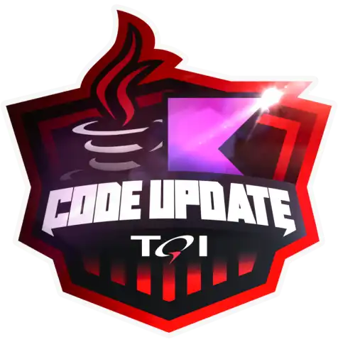

<h1>

Code Update TQI - Backend com Kotlin e Java </h1>

<h3> Andamento do Processo:</h3>

## #1 Princípios de Desenvolvimento Ágil e Colaborativo

  - [x] Bootcamps DIO: Educação Gratuita e Empregabilidade Juntas!
  - [x] Trabalhando em Equipes Ágeis
  - [x] Versionamento de Código com Git e GitHub
  - [ ] Desafios de Projetos: Crie Um Portfólio Vencedor
  - [ ] Contribuindo em um Projeto Open Source no GitHub
  - [ ] Aula Inaugural - Code Update TQI - Backend com Kotlin e Java

   

  

### _#BootcampTQI_

### _#ContratoDeCompromisso_

   

